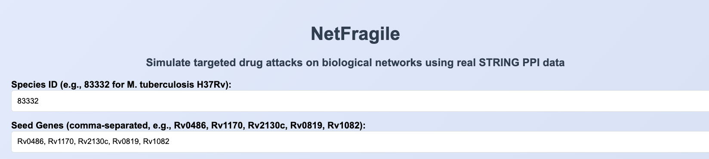
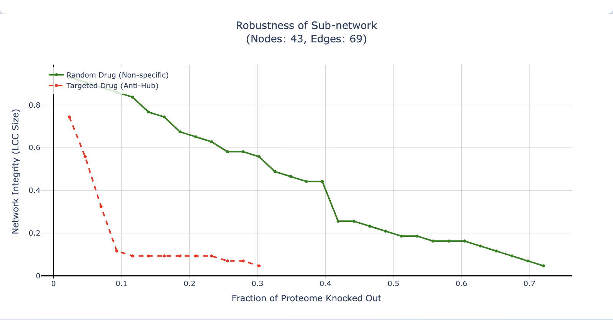
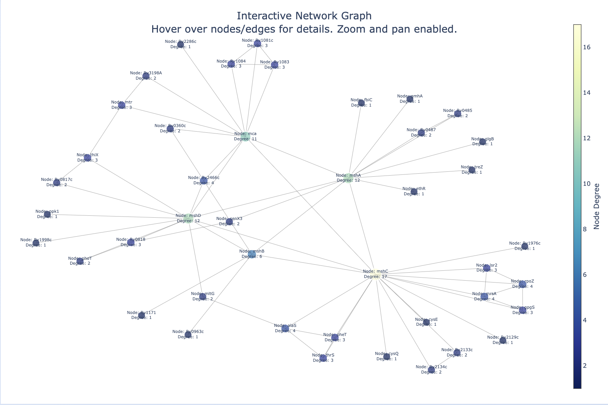
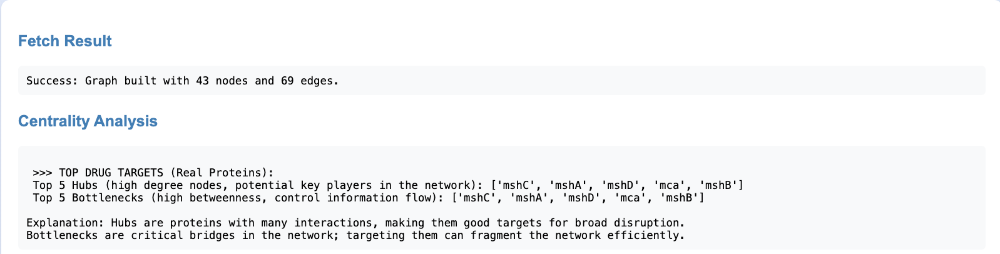

# 🧬 NetFragile: Interactive Biological Network Robustness Analyzer

> **Tagline:** *Simulate targeted drug attacks on protein-protein interaction networks — discover how quickly hubs can collapse a pathway.*

<div align="center">


</div>

---

## 📖 Overview

**NetFragile** is a modern, interactive web application designed to explore the **vulnerability and robustness** of biological networks. Users input a species TaxID and seed genes from a pathway of interest — the tool instantly:

*Inspired by Veritasium's exploration of randomness and prediction in large systems ('The Strange Math That Predicts (Almost) Anything'), NetFragile applies similar ideas to reveal the surprising vulnerability of biological networks.*

- Fetches **high-confidence protein-protein interactions (PPI)** from the STRING database 🧑‍🔬
- Constructs and visualizes the **induced sub-network**
- Identifies **potential drug targets** via centrality (hubs & bottlenecks)
- Simulates **network attacks**: random removal (non-specific effects) vs. targeted hub removal (precision drugs)
- Generates **interactive robustness curves** and a **zoomable network graph**


---

## ✨ Key Features

✅ **Live STRING Database Integration** – Always up-to-date, real-world PPI data   
✅ **Robustness Simulation** – Random vs. targeted attack comparison  
✅ **Intuitive Dash Interface** – Gradient backgrounds, animations, loading spinners, and responsive design  
✅ **Focused Biological Analysis** – Ideal for pathway/module studies in bacteria contexts  

---

## 🛠 Tech Stack

| Layer       | Technologies                          |
|-------------|---------------------------------------|
| **Backend** | Python • NetworkX • Requests • Pandas |
| **Frontend**| Dash • Plotly                         |
| **Data**    | STRING Database API                   |

---

## 🧪 Demo Example: Mycothiol Pathway in *Mycobacterium tuberculosis*

**Input Parameters:**
- **Species TaxID**: 83332 (*M. tuberculosis* H37Rv)
- **Seed Genes**: `Rv0486, Rv1170, Rv2130c, Rv0819, Rv1082` (mshA–D + mca)

**Key Results:**
- Generated a focused sub-network (~200–400 nodes/edges)
- Highlighted top hubs/bottlenecks as candidate drug targets
- Robustness plot: **Targeted attack** causes rapid collapse (red dashed) vs. **random** resilience (green)

### 📸 Screenshots (Mycothiol Analysis)

<div align="center">

  
*Elegant input interface with animations and gradient styling*

  
*Dramatic targeted (red) vs. random (green) collapse curves*
  
  
*Fully interactive PPI visualization – node size/color by degree*

  
*Top predicted targets with clear explanations*

</div>


---


## ▶️ How to Run Locally

```bash
pip install dash plotly networkx requests pandas
python app.py
